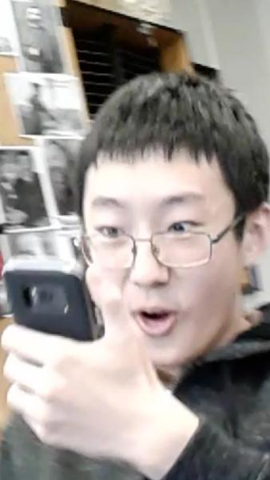
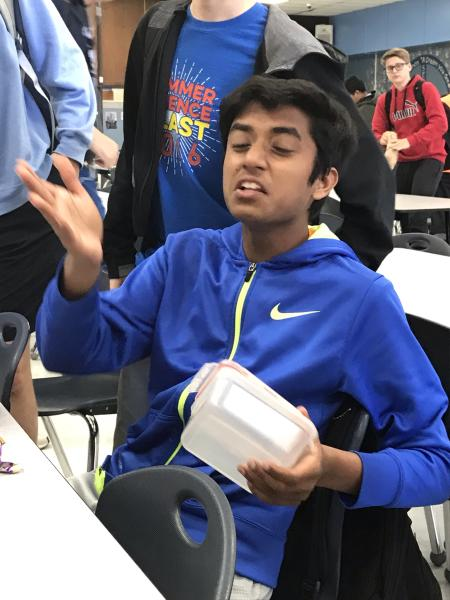
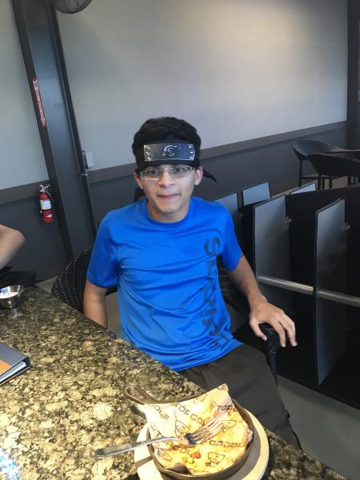

# Friends

1. Shane
Shane was one of my first friends I made when I switched elementery schools. He always acted very clueless when he was younger but now he is extremely
focused and is well aware on what he needs to do to achieve his goals in life.

2. Dhruv
Dhruv and I had a lot of the same classes together in high school so we got close over time.

3. Archis
Archis got me involved in the clubs at school such as the debate and robotics team where I made some very fond memories with him.

